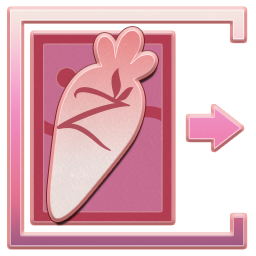
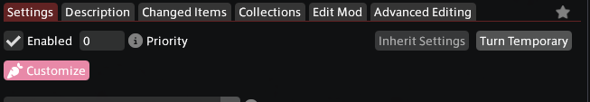
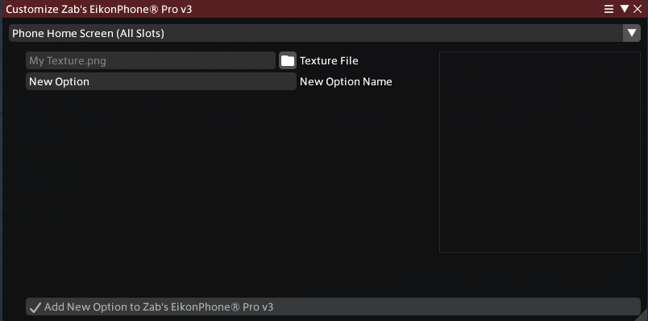

# Zab's Customizer

Zab's Customizer is an FFXIV plugin that lets mod authors configure bespoke customizations to offer to the users of their Penumbra mods.

## Installation

1. Add the custom repo `https://github.com/universalconquistador/Stagehand/releases/latest/download/repo.json` in your Dalamud settings.

   Remember to click the plus icon to actually add the repo after typing/pasting it in, and remember to click the save button as well.

2. Search for Zab's Customizer and install it.

## Usage

1. First, you will need some mods that support this plugin. Alternatively, you can read the [Creators](#Creators) section below to create your own mods with customizations.

2. With Zab's Customizer installed and enabled, you should see a pink 'Customize' button in Penumbra when you select a mod that supports customizations, like this:

   

3. Click the pink Customize button to open the customize window for that mod, which should look like this:

   

4. At the top of the customize window, use the dropdown to select which customization you would like to make.

5. Click the button with the folder icon to browse for the image file you would like to use, and enter a name for the new customization.

6. If you see any red exclamation marks, those indicate things you need to change about the image you are using.

   Images used as video game textures need to have a width and height that are a multiple of four to ensure they can be compressed, and they should have the same aspect ratio as the mod creator recommends or else they will look stretched ingame.

7. Once you have selected an input image with no issues and you have chosen the name for your new customization, click the large Add button at the bottom of the window and wait for the process to finish.

8. Once the procedure is complete, you can go back to Penumbra and select the newly added choices and redraw your character to see the customized mod in action!

## Creators

Customization support is added to a Penumbra mod by authoring a `customizations.json` file in the mod's base directory. The contents of this JSON file is defined in [`CustomizeDefinition.cs`](ZabCustomizer/CustomizeDefinition.cs), and a basic one looks like this:

```json
{
	"Slots": [
		{
			"DisplayName": "Phone Screen",
			"OutputDirectory": "custom_screens\\",
			"AspectRecommendationWidth": 16,
			"AspectRecommendationHeight": 9,
			"Destinations": [
				{
					"GroupJsonFilename": "group_001_phone screen.json",
					"GamePath": "vfx/zab/phone_screen.atex"
				}
			]
		}
	]
}
```

Each customization file defines a list of slots, which are the various customizations that a user can use. Each slot defines how an input image file from the user is to be converted into a .tex file and added as new choices to some of the Penumbra option groups in the mod.

### `"DisplayName": "Phone Screen"` (`string`)

What this slot should be called in the customize window.

### `"OutputDirectory": "custom_screens\\"` (`string`)

The folder that the compressed `.tex` files from this slot should be stored in, relative to the mod's base directory.  
Remember that in JSON files, backslashes must be escaped with another backslash.

### `"AspectRecommendationWidth": 16, "AspectRecommendationHeight": 9` (`int`)

The aspect ratio that this slot expects. If players try to use an image that does not match this aspect ratio, they get an error message instructing them to select an image with the correct ratio.  
This fraction doesn't have to be simplified--you could use a full resolution like 512 : 1024, although this makes the ratio a little less obvious than a simplified fraction would.

### `"Destinations": [ ... ]` (`array`)

Each destination identifies a Penumbra mod option group to add the compressed .tex file to, and the game path to map it to.

#### `"GroupJsonFilename": "group_001_phone screen.json"` (`string`)

The filename of the JSON file that defines the option group to add an entry to, relative to the mod's base directory.

#### `"GamePath": "vfx/zab/phone_screen.atex"` (`string`)

The game path to map the texture file to.

## Human Project

This whole thing is designed and typed by humans, for Zab & the modding community, for the joy of it.
